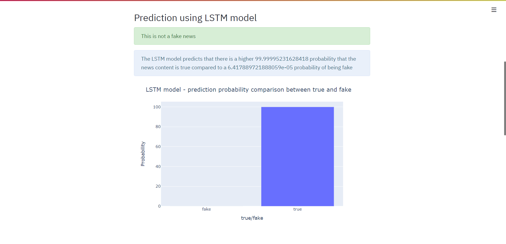
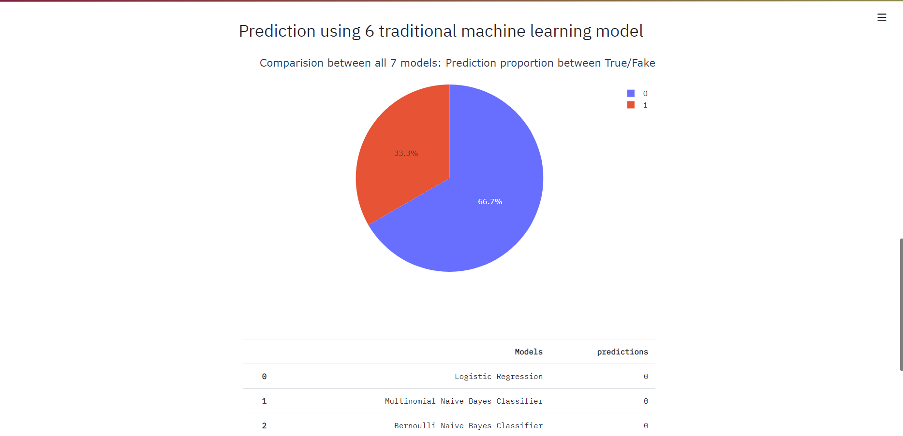

# Fake_news_detection_streamlit_app
A simple streamlit application for detecting fake news using 6 traditional ML classifiers and a LSTM model
## Streamlit interface
Due to upload size restrictions, the LSTM model h5 file cannot be uploaded, the model has to be trained and saved using the LSTM_model_Fake_news.ipynb file

#### LSTM prediction example

#### 6 ML classifier prediction example

