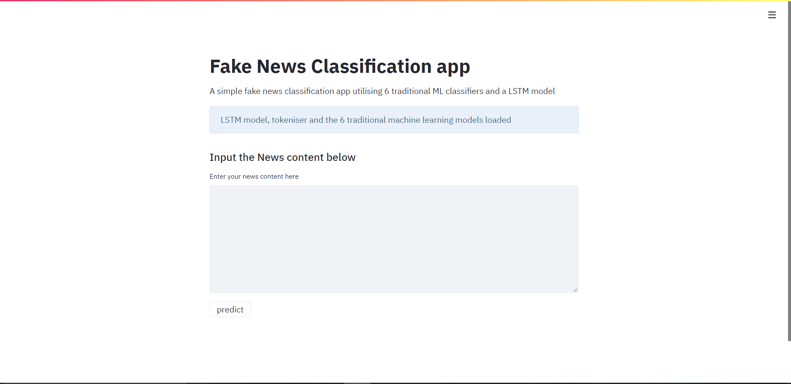

# Fake_news_detection_streamlit_app
A simple streamlit application for detecting fake news using 6 traditional ML classifiers and a LSTM model
## Streamlit interface
Due to upload size restrictions, the LSTM model h5 file cannot be uploaded, the model has to be trained and saved using the LSTM_model_Fake_news.ipynb file. The streamlit app can be loaded using streamlit run streamlit_app.py 

#### LSTM prediction example

The script for preprocessing, training and evaluation of the LSTM model is found in the LSTM_model_Fake_news.ipynb file
#### 6 ML classifier prediction example

The script for preprocessing, training and evaluation of all 6 ML classifiers can be found in the Model_Building_using_traditional_ML.ipynb file
